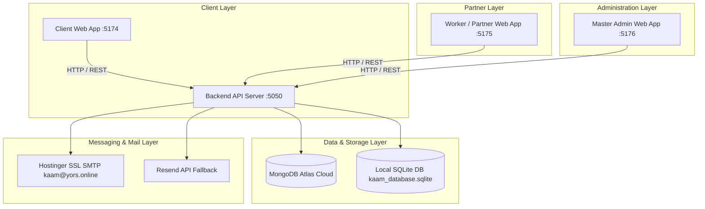
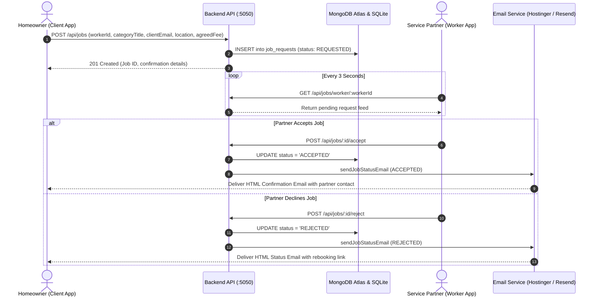
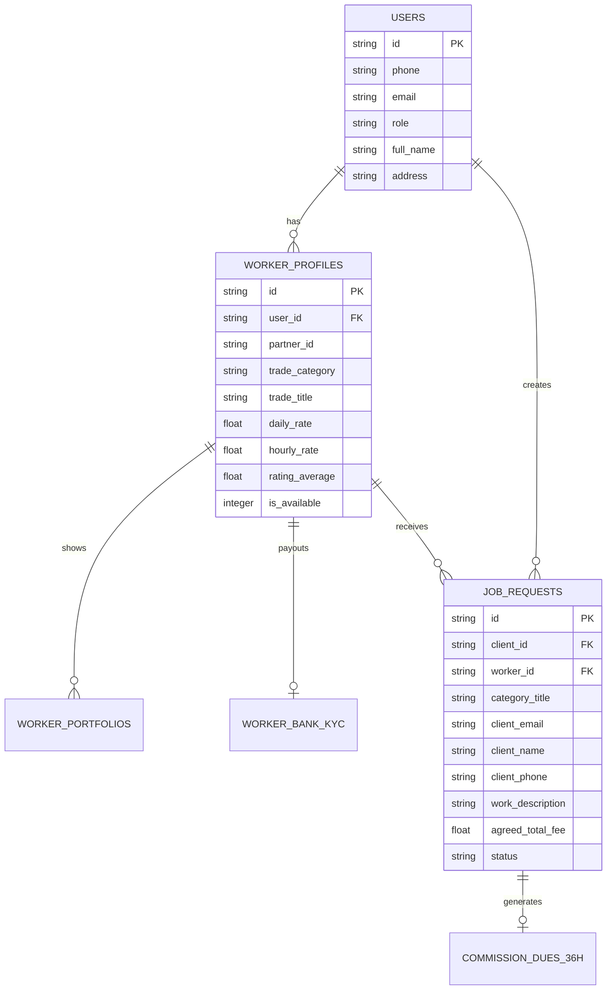

# 🛠️ kaam (काम) — Modern On-Demand Home Services Platform

`kaam` is a production-ready, full-stack on-demand home services platform inspired by Urban Company. It features a standalone multi-app architecture, dual-database resiliency (MongoDB Atlas + SQLite fallback), an advanced Search System Engine with synonym expansion, a multi-ID requesting lifecycle, and automated HTML email notifications.

---

## ⚡ Quick Start & Launch Guide (New Device Setup)

### 1. Clone the Repository
```bash
git clone https://github.com/surya-4034/Kaam.git
cd Kaam
```

### 2. Install All Dependencies (One Command)
```bash
npm install && npm --prefix server install && npm --prefix client-app install && npm --prefix worker-app install && npm --prefix admin-app install
```

### 3. Seed Demo Data & Launch All 4 Services
```bash
# Seed initial demo partners & packages (optional)
cd server && node seed.js && cd ..

# Launch all 4 applications simultaneously
node start-services.js
```

### 4. Open Applications in Your Browser
| Portal | Local URL | Test Credentials / Description |
| :--- | :--- | :--- |
| 🛍️ **Client Web App** | `http://localhost:5174` | Homeowner browsing, search & checkout |
| 👷 **Partner Web App** | `http://localhost:5175` | Service partner login: `+91 7250254074` |
| 🛡️ **Master Admin App** | `http://localhost:5176` | Secret Admin Code: `kaamadmin2026` |
| ⚡ **Backend API Health** | `http://localhost:5050/api/health` | REST API status |

---


## 📐 Overall System Architecture



---

## 🔄 Part 1: Requesting System Architecture

The Requesting System manages the communication bridge between client bookings and worker dispatching.



### Multi-ID Resolution Bridge
To ensure 100% request delivery regardless of how the client selects a worker, the backend dynamically resolves equivalent identifiers:
- **MongoDB ID**: `w-1790195119416`
- **User ID**: `u-1790195119284`
- **Human Partner ID**: `KP-2607`
- **Phone Number**: `+91 7250254074`

Querying jobs by **ANY** of these identifiers returns the full set of job requests for that partner.

---

## 🔍 Part 2: Search System Architecture Engine

The Search System uses an inverted index-style query engine with text pre-processing, tokenization, synonym expansion, multi-field matching, faceted filtering, and relevance ranking.

```mermaid
flowchart TD
    UserQuery[User Search Query: 'electrician near me'] --> PreProc[1. Pre-Processing & Tokenization]
    PreProc --> CleanTokens[Tokens: 'electrician']
    CleanTokens --> SynExp[2. Synonym Expansion Dictionary]
    
    SynExp --> TermList['electrician', 'electric', 'electrical', 'wire', 'wiring', 'fan', 'switch', 'light', 'mcb', 'fuse', 'inverter', 'socket']
    
    TermList --> MultiIndex[3. Multi-Field Inverted Index Engine]
    
    subgraph Multi-Field Evaluator
        MultiIndex --> NameField[name]
        MultiIndex --> PartnerIdField[partnerId KP-XXXX]
        MultiIndex --> TradeCategoryField[tradeCategory]
        MultiIndex --> TradeTitleField[tradeTitle]
        MultiIndex --> MultiSkillsField[categories]
        MultiIndex --> PackagesField[packages.title / category / description]
        MultiIndex --> LocalityField[locality / city]
    end
    
    Multi-Field Evaluator --> FacetFilter[4. Faceted Filtering]
    FacetFilter --> FacetCategory[Category Facet]
    FacetFilter --> FacetLocality[Locality Facet]
    FacetFilter --> FacetBudget[Max Budget Facet]
    FacetFilter --> FacetRating[Min Rating Facet]
    
    FacetFilter --> Ranking[5. Relevance Scoring & Ranking]
    Ranking --> OrderAvailable[1. Online Available Partners First]
    Ranking --> OrderRating[2. Rating Average Descending]
    Ranking --> OrderJobs[3. Completed Jobs Count Descending]
    
    OrderJobs --> OutputJSON[Return Search JSON + searchMeta Metadata]
```

### Synonym Expansion Mapping
- **Electrician**: `electric`, `electrical`, `zap`, `wire`, `wiring`, `fan`, `switch`, `light`, `mcb`, `fuse`, `inverter`, `socket`
- **Plumber**: `plumbing`, `pipe`, `tap`, `leak`, `water`, `drain`, `basin`, `sink`, `toilet`, `flush`, `cpvc`, `tank`, `faucet`
- **Carpenter**: `carpentry`, `wood`, `furniture`, `door`, `window`, `table`, `bed`, `chair`, `cupboard`, `drawer`, `lock`
- **Painter**: `painting`, `paint`, `wall`, `color`, `putty`, `primer`, `texture`, `waterproof`, `distemper`
- **AC Repair**: `ac`, `aircon`, `cooling`, `fridge`, `refrigerator`, `chiller`, `appliance`, `compressor`, `gas`

---

## 🗄️ Database Schemas & Dual-Sync Architecture

The backend operates on a dual-database pattern:
1. **MongoDB Atlas Cloud (`kaam_partner_db` & `kaam_client_db`)**: High-performance primary document store for complete partner profiles, multi-skills categories, 2-step packages, work portfolios, and bank KYC.
2. **Local SQLite (`kaam_database.sqlite`)**: Operational relational storage ensuring zero-downtime local fallback.



---

## 🌐 Multi-App Service Map

| Application | Port | Technology | Purpose |
| :--- | :--- | :--- | :--- |
| **Backend API** | `http://localhost:5050` | Node.js, Express, MongoDB Atlas, SQLite | Core REST APIs, Search Engine, Email Dispatch |
| **Client App** | `http://localhost:5174` | React, Vite, Tailwind CSS, Lucide | Homeowner browsing, search, and checkout |
| **Worker App** | `http://localhost:5175` | React, Vite, Tailwind CSS | Partner onboarding, 2-step package creator, live requests |
| **Admin App** | `http://localhost:5176` | React, Vite, Tailwind CSS | Platform oversight, KYC verification queue, 36h dues audit |

---

## 💻 Step-by-Step Guide: Launching on a New Device

Follow these exact steps to clone, configure, install dependencies, seed data, and launch the entire `kaam` multi-app platform on a new computer or fresh environment.

### 📋 Prerequisites
Ensure the following tools are installed on the target machine:
- **Node.js**: `v18.0.0` or higher (Download from [nodejs.org](https://nodejs.org/))
- **npm**: `v9.0.0` or higher (Bundled with Node.js)
- **Git**: (Download from [git-scm.com](https://git-scm.com/))

---

### Step 1: Clone the Repository
Open a terminal / command prompt on the new device and clone the repository:
```bash
git clone https://github.com/surya-4034/Kaam.git
cd Kaam
```

---

### Step 2: Install Dependencies Across All Applications
The project contains 4 sub-projects (`server`, `client-app`, `worker-app`, `admin-app`).

#### Option A: One-Liner Batch Installation (Recommended)
Run this single command from the project root directory:
```bash
npm install && npm --prefix server install && npm --prefix client-app install && npm --prefix worker-app install && npm --prefix admin-app install
```

#### Option B: Step-by-Step Installation
Alternatively, install packages in each subfolder manually:
```bash
# 1. Root dependencies
npm install

# 2. Backend Server
cd server
npm install
cd ..

# 3. Client Web App
cd client-app
npm install
cd ..

# 4. Worker / Partner Web App
cd worker-app
npm install
cd ..

# 5. Master Admin Web App
cd admin-app
npm install
cd ..
```

---

### Step 3: Environment Variables Setup (`.env`)
The platform is designed to run **out-of-the-box** using local SQLite storage (`kaam_database.sqlite`) without requiring cloud credentials immediately.

If you wish to configure MongoDB Atlas or Custom Email SMTP, create a `.env` file inside the `server/` directory:

```bash
# Create server/.env file
PORT=5050
NODE_ENV=development
MONGODB_URI=mongodb+srv://<username>:<password>@cluster.mongodb.net/kaam_partner_db
SMTP_HOST=smtp.hostinger.com
SMTP_PORT=465
SMTP_USER=kaam@yors.online
SMTP_PASS=your_smtp_password
RESEND_API_KEY=your_resend_api_key
```

---

### Step 4: Seed Initial Demo Data (Optional)
To populate the database with pre-configured partner profiles (Plumbers, Electricians, Carpenters) and service packages:
```bash
cd server
node seed.js
cd ..
```

---

### Step 5: Launch All 4 Services Simultaneously
From the root directory, run the master launcher:
```bash
node start-services.js
```

This master script automatically spawns:
1. ⚡ **Backend API Server** on `http://localhost:5050`
2. 🛍️ **Client Web App** on `http://localhost:5174`
3. 👷 **Worker / Partner App** on `http://localhost:5175`
4. 🛡️ **Master Admin App** on `http://localhost:5176`

---

### Step 6: Access the Applications in Your Browser
Once launched, open your web browser to access each portal:

| Portal | Local URL | Default Test Account |
| :--- | :--- | :--- |
| 🛍️ **Client Web App** | `http://localhost:5174` | Browse services, search, book worker |
| 👷 **Partner Web App** | `http://localhost:5175` | Login: `+91 7250254074` |
| 🛡️ **Master Admin App** | `http://localhost:5176` | Secret Code: `kaamadmin2026` |
| ⚡ **Backend API Health** | `http://localhost:5050/api/health` | Status: `{ "status": "OK" }` |

---

### 🔧 Troubleshooting & Port Clearing

If any port (`5050`, `5174`, `5175`, `5176`) is already in use by another application:

**Windows (PowerShell / CMD):**
```powershell
# Find process using port 5050
netstat -ano | findstr :5050

# Kill process by PID
taskkill /F /PID <PID_NUMBER>
```

**macOS / Linux:**
```bash
# Find and kill process using port 5050
lsof -ti :5050 | xargs kill -9
```

---

## 📦 Project Backup & Deployment Status

- **GitHub Repository**: `https://github.com/surya-4034/Kaam.git`
- **Pen Drive Location**: Saved directly on 32 GB USB Drive (`D:\kaam`).
- **Archive Backup**: Single-file zip archive saved at `D:\kaam_full_project_backup.zip`.

